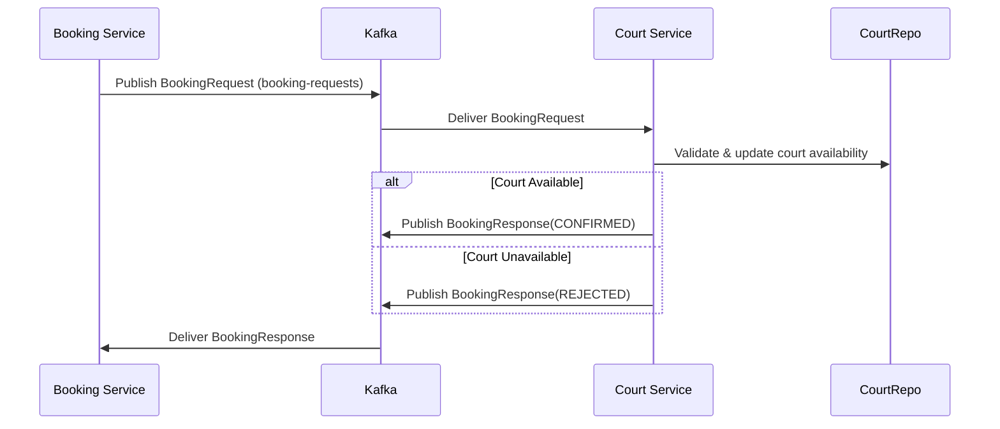

# Court Service

The **Court Service** is a Spring Boot microservice responsible for managing courts within sports arenas. It handles **court creation, booking, deletion, and assignment to arenas**, while also integrating with **Kafka** for asynchronous booking request/response communication.

It is secured with **JWT authentication** and enforces **role-based access control** for `ADMIN` and `CUSTOMER` users.

---

## Features

* **Add Court** (Admin only)
* **Delete Court** (Admin only)
* **Book Court** (Customer)
* **Fetch Available Courts** by arena
* **Assign Courts** to an Arena
* **Kafka Integration**:

  * Consumes **booking requests**
  * Produces **booking responses** (Confirmed/Rejected)
* **JWT authentication & role-based security**

---

## Tech Stack

* **Java**: 17+
* **Spring Boot**: 3.x
* **Spring Security + JWT**
* **Spring Data JPA** with PostgreSQL
* **Spring Kafka** for messaging
* **Eureka Client** for service discovery
* **Maven** for build & dependency management

---

## Getting Started

### Prerequisites

Make sure you have installed:

* Java JDK 17+
* Maven 3.8+
* PostgreSQL 14+
* Apache Kafka + Zookeeper
* Eureka Service Registry running on port `8761`

### Database Setup

Create a database in PostgreSQL:

```sql
CREATE DATABASE CourtDetailsDatabase;
```

Update `application.properties`:

```properties
spring.datasource.url=jdbc:postgresql://localhost:5432/CourtDetailsDatabase
spring.datasource.username=postgres
spring.datasource.password=your_password
```

### Run Locally

```bash
mvn clean install
mvn spring-boot:run
```

Service runs at:
👉 [http://localhost:8082](http://localhost:8082)

---

## Security & Roles

* **Admin**:

  * Add, Delete, Assign courts
* **Customer**:

  * Book courts
  * View available courts
* All endpoints require JWT authentication.

---

## API Endpoints

### Court Management

* **Add Court**

  ```http
  POST /courts/add
  {
"type":"Single",
"price":23.89,
"isAvailable":"True",
"sportsArenaId":null
}
  ```

* **Delete Court**

  ```http
  DELETE /courts/delete/{courtNumber}
  ```

* **Assign Courts to Arena**

  ```http
  PUT /courts/assign
  ```

  **Request Body:**

  ```json
  {
    "arenaId": 1,
    "courtIds": [101, 102]
  }
  ```

* **Get Available Courts**

  ```http
  GET /courts/{arenaId}
  ```

* **Book Court**

  ```http
  POST /courts/book/{courtNumber}
  ```

---

## Kafka Messaging

### Topics

* **booking-requests** (Consumer)
* **booking-responses** (Producer)

### Booking Flow

1. **Booking Service** sends request to `booking-requests`.
2. **Court Service** consumes request:

   * If available → marks court unavailable & responds `CONFIRMED`.
   * If unavailable → responds `REJECTED`.
3. Sends response to `booking-responses`.

---

## Architecture Flow (Sequence Diagram)



---

## Notes

* Courts are persisted in PostgreSQL.
* Kafka ensures **asynchronous booking confirmation**.
* JWT is validated for every API call.
* Only **Admin** can create or delete courts, while **Customers** can book available courts.

---
